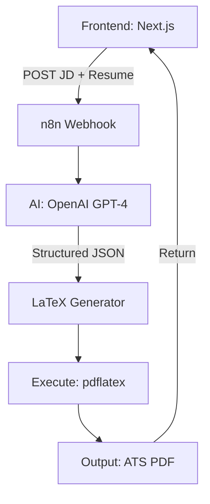

# 🚀 GenSyncAI: AI-Powered ATS Resume Synchronizer

[](https://nextjs.org/)
[](https://tailwindcss.com/)
[](https://n8n.io/)
[](https://www.latex-project.org/)

**GenSyncAI** is a production-grade AI system designed to bridge the gap between job descriptions and candidate resumes. It analyzes deep requirements, rewrites content using impact-driven formulas (X-Y-Z), and generates ATS-perfect LaTeX resumes that pass through any recruiter filter with a premium touch.

---

## ✨ Features

- 🧠 **Deep JD Analysis**: Extracts core responsibilities and hidden keywords using GPT-4.
- ⚡ **Impact-Driven Rewriting**: Automatically reframes experiences with strong action verbs and quantified results.
- 📄 **Overleaf-Quality LaTeX**: Outputs high-fidelity PDFs via a dedicated LaTeX compilation engine.
- 🎯 **ATS Optimization**: Zero tables, columns, or graphics—just clean, parsable typography.
- 📊 **Real-time ATS Scoring**: Visual feedback on how well your resume matches the target role.
- 🎨 **Premium UI**: Modern, glassmorphic dashboard built with Next.js 15 & Framer Motion.

---

## 🏗️ Architecture Flow



---

## 🛠️ Tech Stack

- **Frontend**: [Next.js 15](https://nextjs.org/) (App Router), [Tailwind CSS v4](https://tailwindcss.com/), [Framer Motion](https://www.framer.com/motion/)
- **Backend Automation**: [n8n](https://n8n.io/) (Docker-based)
- **AI Brain**: [OpenAI API](https://openai.com/)
- **PDF Engine**: [pdflatex](https://www.latex-project.org/) (Dedicated Docker Container)
- **Deployment**: Docker Compose

---

## 🚀 Getting Started

### 1. Clone the Repo
```bash
git clone https://github.com/codest0411/GenSyncAI.git
cd GenSyncAI
```

### 2. Start Infrastructure
Ensure Docker is running, then launch the backend:
```bash
docker-compose up -d
```

### 3. Launch the App
```bash
cd frontend
npm install
npm run dev
```

### 4. Configure n8n
- Open `http://localhost:5678`
- Import the logic from `master_prompt.txt` and `latex_generator.js`.
- Update your production webhook URL in `frontend/src/app/page.tsx`.

---

## 📄 License
This project is licensed under the MIT License - see the [LICENSE](LICENSE) file for details.

---

## 🤝 Contributing
Contributions are welcome! Feel free to open an issue or submit a pull request.

---

<p align="center">
  Built with ❤️ for career growth by <b>GenSyncAI Team</b>
</p>
